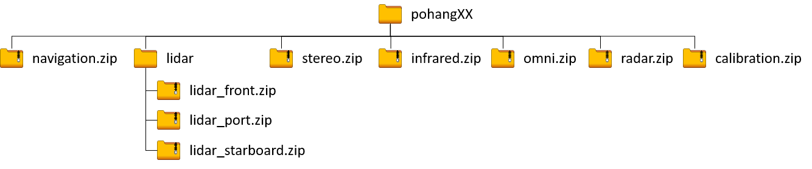

# Pohang Canal Dataset

  

## About

This dataset presents a multi-modal maritime dataset acquired in restricted waters in Pohang, South Korea. The sensor suite is composed of three LiDARs (one 64-channel LiDAR and two 32-channel LiDARs), a marine radar, two visual cameras used as a stereo camera, an infrared camera, an omnidirectional camera with 6 directions, an AHRS, and a GPS with RTK. The dataset includes the sensor calibration parameters and SLAM-based baseline trajectory. It was acquired while navigating a 7.5 km route that includes a narrow canal area, inner and outer port areas, and a near-coastal area. The aim of this dataset is to facilitate research on autonomous surface 

The detailed description about the dataset is available at [here](https://sites.google.com/view/pohang-canal-dataset/home).


## Download
You can either submit the form in [here](https://sites.google.com/view/pohang-canal-dataset/download) to get the download URL or use the AWS CLI to download the dataset. As some files are large (>100GB), we recommand you to use the AWS CLI for reliable download.

### Download using AWS CLI

The dataset configuration in AWS S3 is configured as following:



The bucket s3 url is as : s3://pohang-canal-dataset

#### pohang0n

There are 6 scenarios (pohang00, pohang01, pohang02, pohang03, pohang04, pohang05) where pohang01 and pohang05 is acquired at night and the rest of the scenarios are acquired at daytime. Omnidirectional images are not available for the nighttime dataset (pohang01 and pohang05).

#### AWS CLI

You can copy the files in the s3 storage by using the following command:
```sh
$ aws s3 cp s3://pohang-canal-dataset/<file_you_want_to_download> <your_directory>/
```

or download the whole files in a sequence:
```sh
$ aws s3 sync s3://pohang-canal-dataset/pohang0n <your_directory>/
```

If you don't have an AWS account, simply add '--no-sign-request' at the end of the command.


## Copyright

This work is licensed under a [Creative Commons Attribution-NonCommercial 4.0 International License](https://creativecommons.org/licenses/by-nc/4.0/).